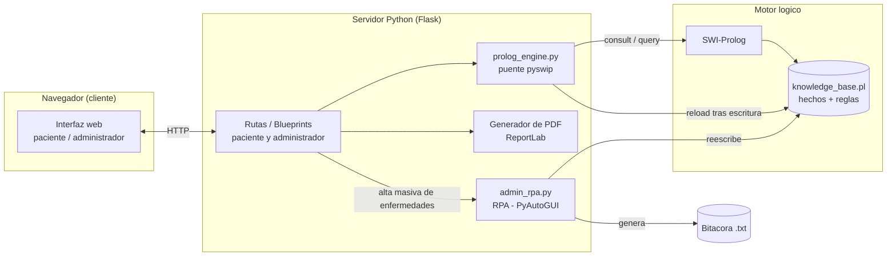
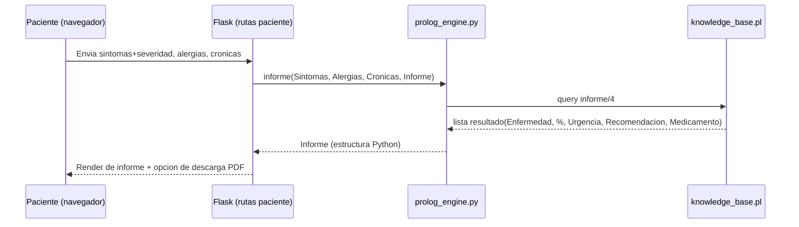
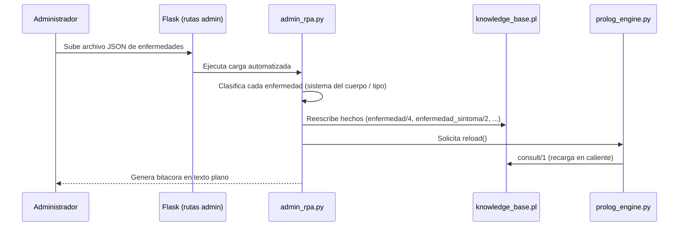

# Diagramas de arquitectura — MediLogic (borrador, Entrega No. 1)

## 1. Arquitectura general (cliente-servidor)

**Nota de arquitectura:** toda la logica de decision (calculo de afinidad, contraindicaciones,
nivel de urgencia) vive exclusivamente en `knowledge_base.pl`. Python nunca reimplementa esa
logica: solo la invoca via `pyswip` y transforma el resultado para la interfaz web, cumpliendo
el requisito de la seccion 4.3 ("la logica de Prolog exclusivamente debe ser en Python" se
interpreta, y se documenta en `docs/decisiones_tecnicas.md`, como *"la unica logica de negocio
vive en Prolog; Python actua solo como puente/orquestador"*).

## 2. Flujo de un diagnostico (paciente)

## 3. Flujo de actualizacion administrativa (incluye RPA)

Ver también [docs/mockups/README.md](../mockups/README.md) para el diagrama de navegación
entre pantallas.

---
*Diagramas en borrador para la Entrega No. 1. Se ampliarán (diagrama de clases/módulos del
backend, diagrama entidad-relación del archivo .pl) para el Manual Técnico final.*
