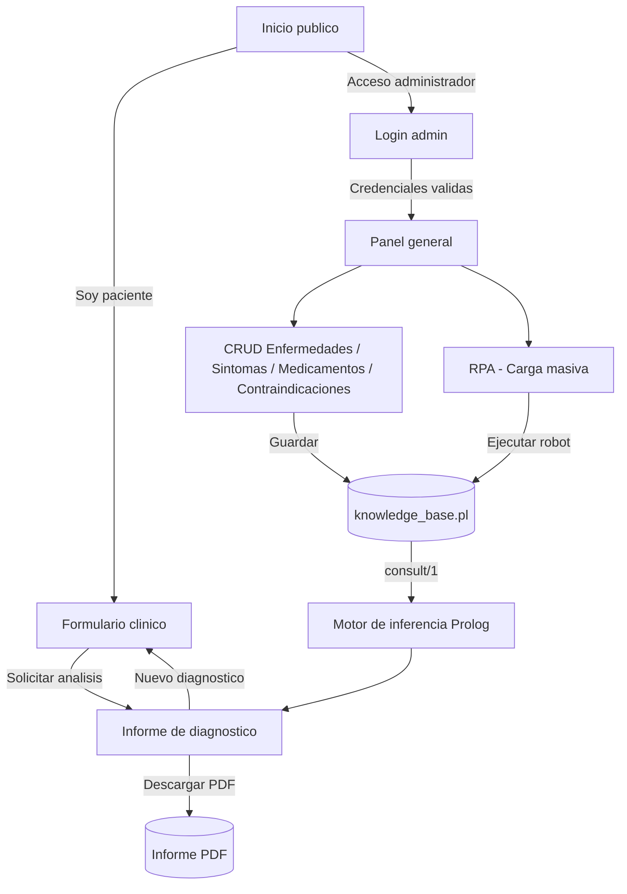

# Diseño de interfaz — MediLogic

Este directorio contiene el diseño de interfaz (wireframes) del entregable de la Entrega
No. 1 — Tarea 1. Se implementaron como **HTML/CSS estático navegable** (no como imágenes)
para que puedan abrirse directamente en el navegador y, sobre todo, para que sirvieran de
base real a las plantillas Jinja2 del backend Flask — la maquetación y la paleta de colores
se reutilizaron tal cual en `src/backend/templates/` y `src/backend/static/css/styles.css`.

> ✅ **Estado:** estos 7 mockups ya fueron implementados como aplicación real (formularios
> funcionales, autenticación, CRUD contra `knowledge_base.pl`, PDF, RPA). Se conservan aquí
> como evidencia de la fase de diseño y como referencia visual; la interfaz activa del
> proyecto es la que corre con `python src/backend/app.py` (ver `README.md`).

Ningún archivo aquí tiene lógica real: los formularios no envían datos y los botones son
enlaces entre pantallas para poder recorrer el flujo completo. Los datos mostrados (síntomas,
enfermedades, porcentajes de afinidad) son de ejemplo, tomados de `EjemploRPA.json`.

## Cómo verlas

Abrir `01_inicio.html` en un navegador y navegar desde ahí, o abrir cualquier archivo
directamente — todas comparten `assets/styles.css`.

## Pantallas incluidas

| Archivo | Pantalla | Referencia en el enunciado |
|---|---|---|
| `01_inicio.html` | Inicio público, sin autenticación | Sección 4.2 — Inicio |
| `02_paciente_formulario.html` | Formulario de ingreso clínico (síntomas + severidad, alergias, enfermedades crónicas) | Sección 4.2 — Pacientes |
| `03_paciente_resultado.html` | Informe de diagnóstico (afinidad, urgencia, medicamento seguro, reglas activadas, historial de sesión, descarga PDF) | Sección 4.2 — Pacientes |
| `04_admin_login.html` | Autenticación del módulo administrativo | Sección 4.2 — Administrador |
| `05_admin_dashboard.html` | Panel general / resumen de la base de conocimiento | Sección 4.2 — Administrador |
| `06_admin_enfermedades.html` | CRUD de enfermedades (mismo patrón para síntomas, medicamentos y contraindicaciones) | Sección 4.2 — Administrador |
| `07_admin_rpa.html` | Ejecución del RPA de carga masiva y bitácora generada | Sección 4.2 — Automatización de funciones de administrador |

## Flujo de navegación

## Decisiones de diseño

- **Paleta de color con significado clínico:** verde = observación/bajo riesgo, ámbar =
  posible automanejo/riesgo moderado, rojo = consulta médica inmediata. Se usa de forma
  consistente en badges y en el nivel de urgencia, para que el paciente interprete el
  resultado de un vistazo (requisito de "visualización clara... barras de afinidad o
  alertas de advertencia" de la sección 4.2).
- **Barra de afinidad** como elemento visual principal de cada diagnóstico, en vez de solo
  un número, para comunicar la proporción calculada por el motor Prolog.
- **Bloque "reglas Prolog activadas"** visible en cada resultado, para cumplir el
  requerimiento explícito de explicar qué reglas se activaron para llegar a la conclusión.
- **Layout de administrador con sidebar fijo**, reutilizable en todas las pantallas del CRUD,
  para minimizar la cantidad de plantillas distintas a mantener en el backend.
